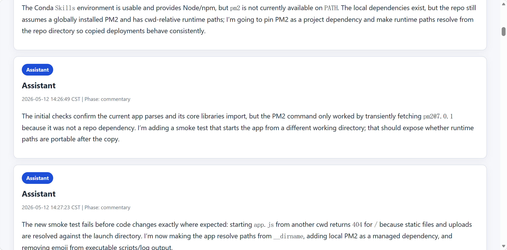
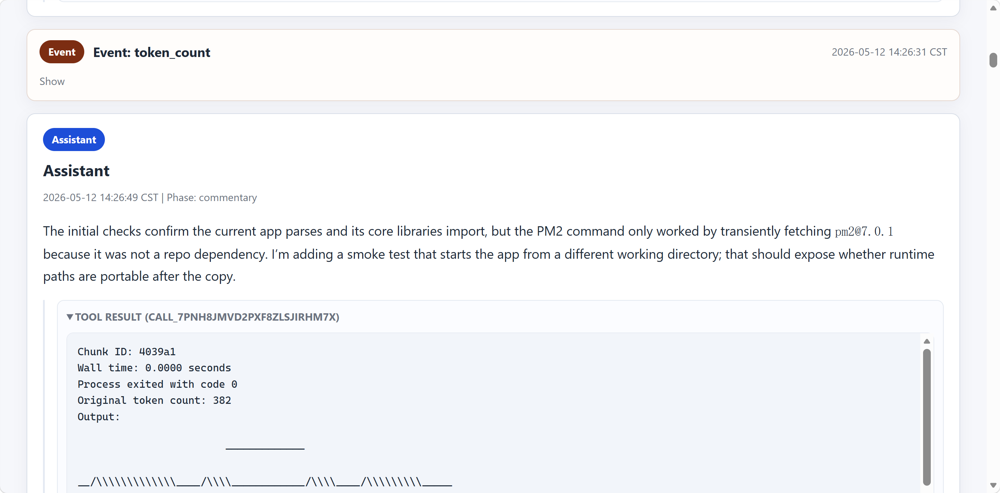
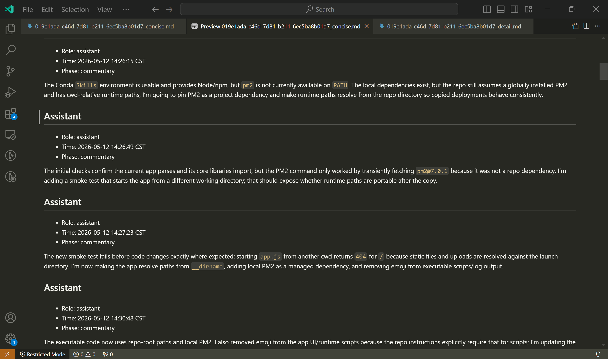
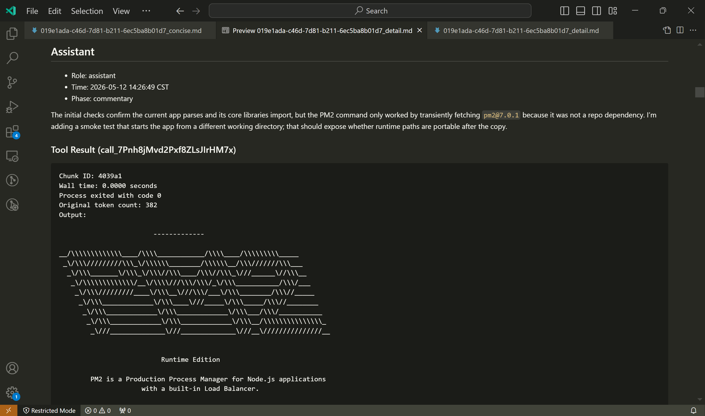

# CLI Chat Exporter

[中文](README_zh.md)

[](https://www.npmjs.com/package/@benryoung/cli-chat-exporter)
[](https://github.com/benryoung/cli-chat-exporter/actions/workflows/ci.yml)
[](LICENSE)

CLI Chat Exporter provides the `cce` command for exporting local AI assistant chat histories to readable Markdown and HTML archives.

It currently supports local histories from Codex, Cursor, and OpenClaw. The npm CLI is intentionally scoped to the current local user.

## Preview

| Format | Concise | Detail |
| --- | --- | --- |
| HTML |  |  |
| Markdown (previewed) |  |  |

## Installation

```bash
npm install -g @benryoung/cli-chat-exporter
```

Requirements:

- Node.js 20 or newer.
- Python 3 available as `python3` or `python`, or configured through `CCE_PYTHON` / `runtime.python`.
- Linux or WSL for automatic local-user discovery.

## Quick Start

```bash
cce help
cce doctor
cce config init # interactive setup, including scheduled service
cce export --source all --format both --output ~/AIChatRecords # manual backup
```

The default output directory is `~/AIChatRecords`. Each export writes both concise and detailed versions unless you choose a single format.

## What It Exports

`cce export` scans local session files for:

- Codex
- Cursor
- OpenClaw

Supported output formats:

- Markdown (`.md`)
- HTML (`.html`)
- Both formats in one run

Each session is exported as:

- `*_concise`: user and assistant conversation content for reading and archiving.
- `*_detail`: additional metadata, tool calls, events, and diagnostic context.

## How It Works

```text
Current user home
    |
    +-- ~/.codex/sessions/...
    +-- ~/.cursor/projects/...
    +-- ~/.openclaw/agents/...
            |
            v
    Python exporter core
            |
            v
    Markdown / HTML archive files
```

The npm package is a Node.js wrapper around the Python exporter core. Runtime logs are written outside the package directory under the configured state/log paths.

## Commands

```bash
cce help
cce version
cce doctor
cce export [--source all|codex|openclaw|cursor|auto] [--format both|html|md] [--output DIR] [--overwrite]
cce config get
cce config init
cce config set [--source SOURCE] [--output DIR] [--earliest HH:MM] [--latest HH:MM] [--interval 1h] [--log-dir DIR]
cce service run
cce service start
cce service stop
cce service status
```

## Configuration

```bash
cce config get
cce config init
cce config set --output ~/AIChatRecords --source all --earliest 00:00 --latest 23:00 --interval 1h
```

Configuration is stored at:

```text
~/.config/cce/config.json
```

Runtime state and logs default to:

```text
~/.local/state/cce/
```

## Scheduled Service

Start a lightweight background scheduler:

```bash
cce service start
cce service status
```

Stop it:

```bash
cce service stop
```

This is a user-level process, not a system service manager integration.

## Current-User Scope and Privacy

The npm CLI exports only the current local user's readable chat histories. It does not request elevated privileges, write sudoers rules, or attempt to read other users' home directories.

All processing is local. The tool does not upload chat records.

## Advanced Python Usage

The underlying Python exporter still supports explicit user scope for local administrator workflows. For example, on a machine you administer:

```bash
sudo /path/to/python /path/to/chatManager/export_session.py --user all --format both --output /path/to/AIChatRecords
```

This mode is intentionally not exposed through the npm CLI.

## Troubleshooting

Check the runtime first:

```bash
cce doctor
```

If `cce` cannot find Python, either install Python 3 or set:

```bash
export CCE_PYTHON=/path/to/python
```

If exports appear empty, verify that the current user has local histories under supported application directories.

## Development

```bash
npm test
npm run pack:check
```

## License

MIT
